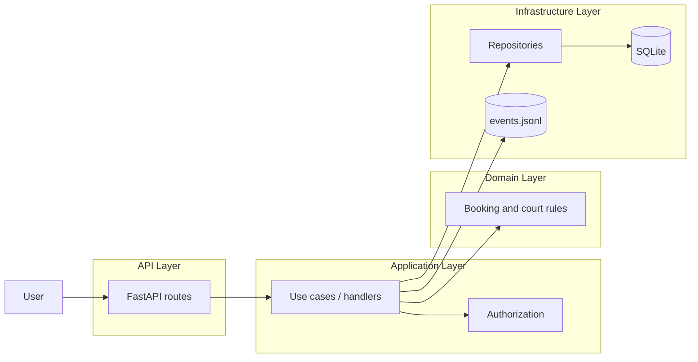

# Courtly Architecture

## Overview

Courtly is designed as a layered booking system for tennis courts.

Core ideas:

- `SQLite` is the primary source of truth for operational state
- `events.jsonl` is an append-only audit trail
- the backend should evolve toward clear API, application, domain, and infrastructure boundaries

At the current stage, the implemented code mainly covers:

- API bootstrap
- database setup
- ORM models
- migrations

## High-Level Architecture

## Layers

### API Layer

Location:

- `app/api/`

Responsibilities:

- define HTTP routes
- validate request shape
- map request/response models
- call application services or repositories

Rules:

- no business rules in routes
- no raw SQL in routes
- keep handlers small

### Application Layer

Planned location:

- `app/application/`

Responsibilities:

- orchestrate use cases
- call authorization checks
- invoke domain operations
- persist results
- append audit events

Rules:

- no framework-heavy code
- no direct HTTP handling
- coordinate, do not own persistence details

### Domain Layer

Planned location:

- `app/domain/`

Responsibilities:

- booking rules
- court availability rules
- slot validation
- authorization-relevant invariants when applicable

Examples:

- a booking must reserve at least 2 slots
- a slot cannot be double-booked
- a booking must fit inside court working hours

Rules:

- no SQLAlchemy session usage
- no FastAPI imports
- no direct file I/O

### Infrastructure Layer

Location:

- `app/infrastructure/`

Responsibilities:

- database engine/session setup
- SQLAlchemy models
- repository implementations
- event log persistence

Current files:

- `sqlite.py`
- `models.py`
- `repository.py`
- `event_store.py`

## Persistence Model

### Source of Truth

`SQLite` is the canonical operational database.

It stores:

- users
- courts
- court opening hours
- bookings
- booking slots

### Audit Trail

`db/events.jsonl` is append-only and stores domain events for:

- auditability
- debugging
- rebuild/recovery workflows

It is not the primary read/write store for the application.

## Database Design

### `users`

Stores application users and roles.

Important constraints:

- unique `email`
- `is_active` soft-activation flag

### `courts`

Stores bookable courts and their metadata.

Important fields:

- location data
- surface type
- `is_active`

### `court_hours`

Stores recurring weekly availability for each court.

Important constraints:

- one row per `court_id + weekday`
- valid day range
- `start_time < end_time`

### `bookings`

Stores the booking entity itself.

Important fields:

- booking owner
- court
- start and end datetime
- slot count
- booking status

Important constraints:

- `slot_count >= 2`
- valid time range
- controlled status values

### `booking_slots`

Stores one row per reserved 30-minute slot.

This table exists to make conflict detection simple and reliable.

Important constraints:

- unique `court_id + slot_start`
- unique `booking_id + slot_start`

Result:

- overlapping bookings are blocked by the database design, not only by Python logic

## Booking Model

Courtly uses a fixed slot strategy:

- one slot = 30 minutes
- minimum booking = 2 slots
- booking duration is represented by `start_time`, `end_time`, and `slot_count`

Example:

- `start_time = 10:00`
- `end_time = 11:30`
- `slot_count = 3`

Then `booking_slots` contains:

- `10:00`
- `10:30`
- `11:00`

## Read Flow

The intended read flow is:

1. API receives request
2. Authorization is applied if needed
3. Repository queries SQLite
4. API returns response

Read operations should not depend on the event log.

## Write Flow

The intended write flow is:

1. API receives request
2. Application layer validates and orchestrates use case
3. Domain rules are checked
4. Repository writes to SQLite
5. Event is appended to `events.jsonl`

Write ordering matters:

- SQLite write establishes current state
- event log records the action for audit and rebuild

## Migrations

Schema changes should be handled with Alembic.

Why:

- versioned schema history
- repeatable deployments
- controlled upgrades
- safer than relying on `create_all()` for evolving schema

Current migration setup:

- `alembic.ini`
- `alembic/env.py`
- `alembic/versions/`

SQLite-specific note:

- `render_as_batch=True` is enabled in Alembic configuration to support SQLite schema changes more safely

## Runtime Layout

### Backend

- `app/main.py` boots FastAPI
- `app/api/routes.py` exposes routes
- backend listens on port `5000`

### Frontend

- `web/` contains the React app
- Vite runs on port `5173`

### Containers

`docker-compose.yaml` runs:

- `api`
- `web`

The backend container applies migrations before starting the app.

## Coding Guidelines

### Backend

- routes stay thin
- repositories own query logic
- models define persistence, not business policy
- domain logic should become framework-independent
- use migrations for every schema change

### Database

- prefer explicit constraints
- keep slot-conflict rules enforceable at the DB level
- avoid storing duplicated state unless it improves clarity and queryability

### Event Log

- append only
- no in-place mutation
- event payloads should be stable and readable

## Planned Evolution

Reasonable next backend additions:

- repository implementation for courts and bookings
- application handlers for booking flows
- event log append service
- booking creation endpoint with slot conflict checks
- rebuild script that reconstructs state from events