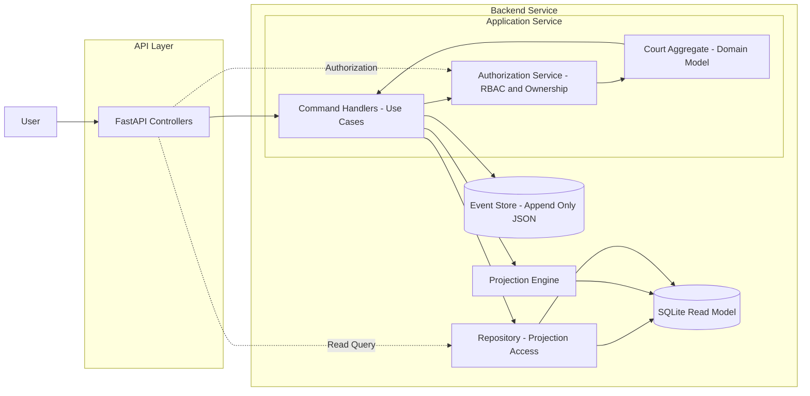

# Tennis Court Booking System [task #4]

Event-sourced booking system with append-only JSON event log and SQLite read model.
Supports full database rebuild from event log.

---
## Backend Architecture Overview



---

### Event Store (Canonical Source of Truth)
Append-only JSON log that stores all domain events.
Every state change in the system must produce an event.

The event store guarantees:
- full system rebuild capability
- immutable history

No updates or deletes are allowed. Only append.

---

### SQLite (Read model)
SQLite DB acts as projection layer for read operations.

is:
- stores the current system state
- can be rebuild entirely from the event log

---

### Application Service
The Application layer coordinates the execution of use cases.

Responsibilities:
- load aggregate state
- perform authorization checks
- invoke domain logic
- append events to the event store
- trigger projection updates

---

### Domain Layer
The Domain layer contains aggregates and enforces business rules.

It:
- validates invariants (e.g., no double booking)
- produces domain events
- contains no infrastructure dependencies

The domain is unaware of persistence, authorization, or transport concerns.

---

### Authorization Service (RBAC and Ownership)
Authorization is enforced within the Application layer before domain execution.

It:
- verifies role-based permissions
- enforces ownership rules
- prevents unauthorized state transitions

Authorization logic is kept separate from business logic.

---

### Repository


Repositories provide access to the read model and construct aggregates for domain execution.

Responsibilities:
- load aggregate state from SQLite
- expose read queries for API
- isolate SQL from application and domain layers

Repositories must not contain business logic.

---

## Write flow

The only way to write/modify data

1. Load aggregate
2. Authorize action
3. Execute domain method (returns event)
4. Append event to Event store
5. Apply event to projection

## Read flow

API -> Authorization (If needed) -> Repository -> SQLite

## Project Structure

```
.
├── app
│   ├── api
│   │   └── routes.py
│   ├── application
│   │   ├── authz_service.py
│   │   └── handlers.py
│   ├── domain
│   │   └── court.py
│   ├── infrastructure
│   │   ├── event_store.py
│   │   ├── projector.py
│   │   ├── repository.py
│   │   └── sqlite.py
│   ├── main.py
│   └── rebuild.py
├── docker-compose.yaml
├── events.jsonl
├── README.md
├── requirements.txt
└── web
    # React App here
```

## Event schema

```
{
  "event_id": "uuid",
  "aggregate_type": "Court",
  "aggregate_id": "court-1",
  "version": 3,
  "event_type": "SlotBooked",
  "payload": {
    "slot": "2025-03-15T18:00",
    "user_id": "user-42"
  },
  "timestamp": "2025-03-02T14:23:11Z",
  "metadata": {
    "performed_by": "user-42",
    "role": "user"
  }
}
```

## Development threads

### Thread 1 
Andrii 
Ulia

Database, Event log, Database recreation & Data Repository

---

### Thread 2
Vlad
Masik

Business logic, Auth, Roles, API

---

### Thread 3
Juliana
Adriana

Front-end

---


```
@app.get("/api/v1/user<user_id>")
def my_data(user_id):
    user = users.get(user_id = user_id)

    return {"payload": user.data}

@app.post("/api/v1/sign_up")
def sign_up():
    username = request.get("username")
    ...

    user_event = users.create(username, ...)

    events.append(user_event)

    projections.apply()
```